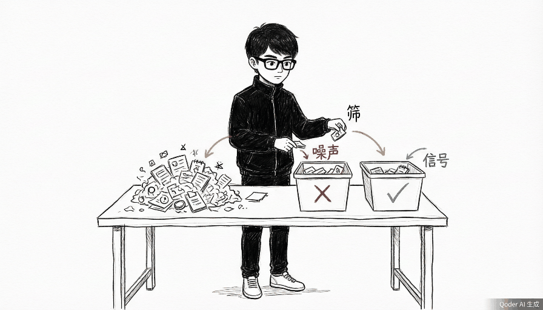
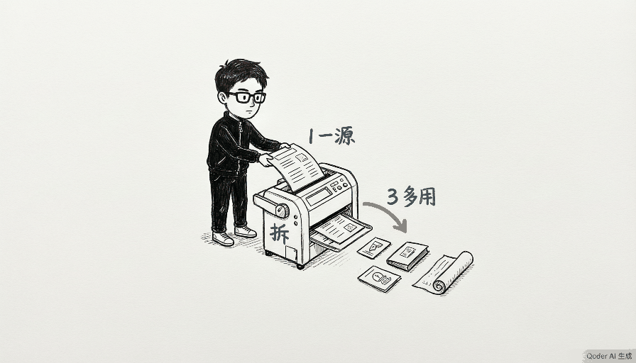
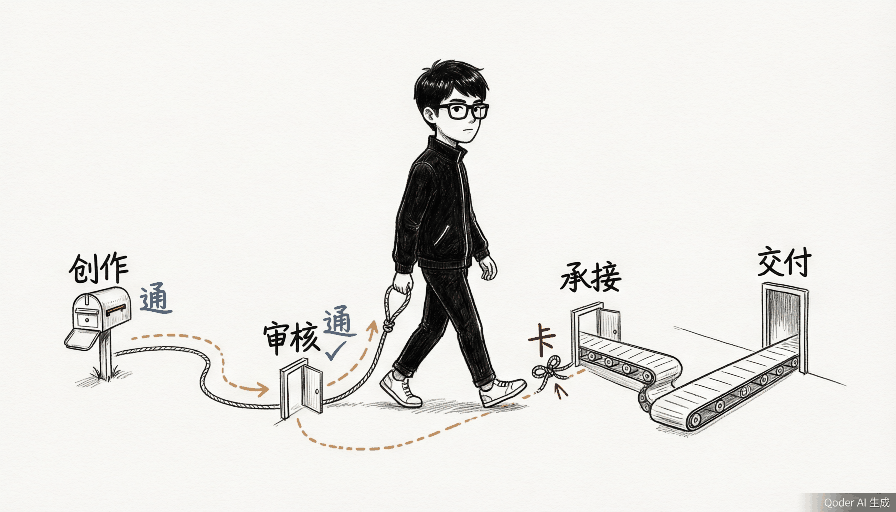
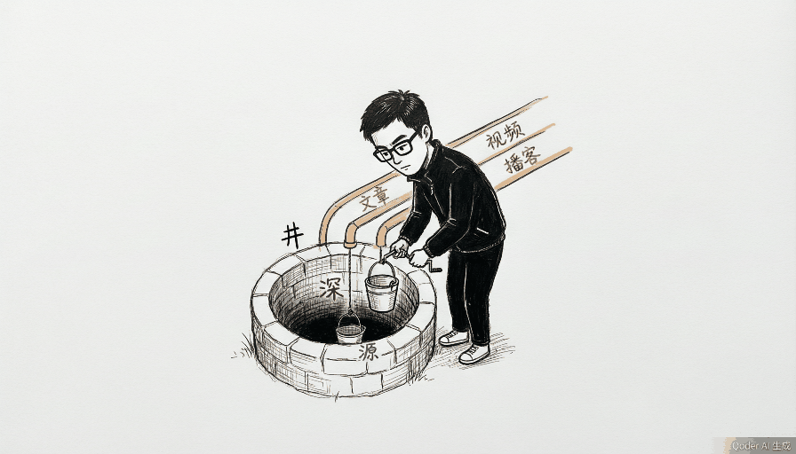
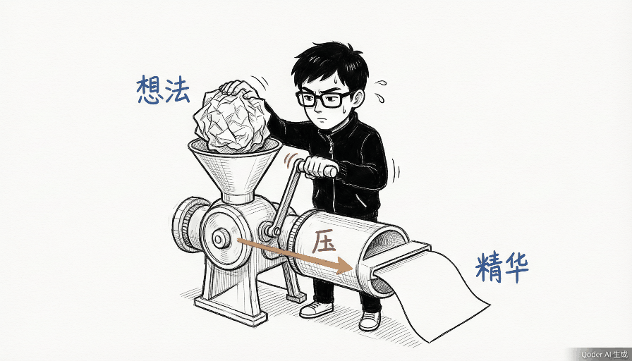
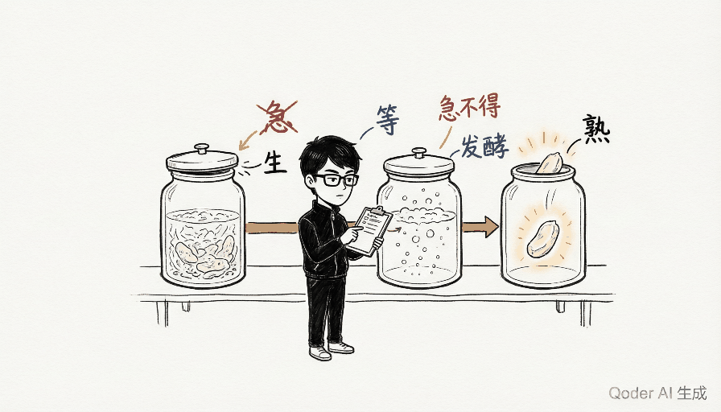
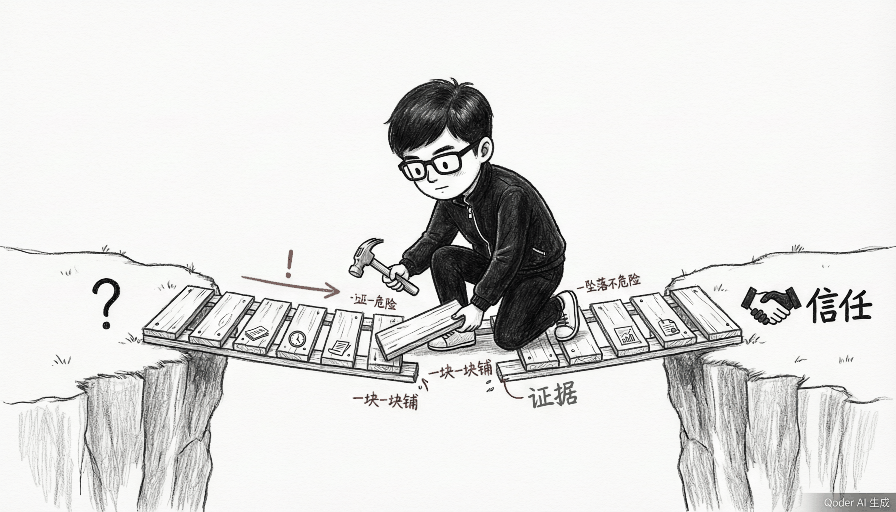

# Leohang Illustrations

> 把中文文章里的判断、流程、状态和隐喻，变成一张张白底、手绘、怪诞但清爽的 16:9 正文配图。

一个 AI Agent Skill，指导 AI 为中文文章生成正文配图。不是通用插画 prompt，不是 PPT 信息图模板——先理解文章的认知锚点，再把其中一个判断、流程、结构、状态或隐喻，变成一张有记忆点的手绘解释图。

**IP 角色：Leohang** — 戴方形黑框眼镜、穿黑色高领夹克的年轻技术人。专注、冷静、动手派工程师，认真做一件荒诞但成立的事。

---

## 效果展示

| 断点排查 | 信号分拣 | 一源多用 | 承接路径 |
|---------|---------|---------|---------|
|  |  |  |  |

| 信息深井 | 想法压机 | 沉淀发酵 | 信任之桥 |
|---------|---------|---------|---------|
|  |  |  |  |

这些是风格校准样例，不是构图模板。每次使用都会从当前文章重新发明隐喻。

---

## 安装

### 一键安装

```bash
curl -fsSL https://raw.githubusercontent.com/YOUR_USERNAME/leohang-illustrations/main/install.sh | bash
```

脚本会自动检测你使用的编辑器，将对应文件安装到正确位置。

### 手动安装

根据你的编辑器选择对应方式：

**Claude Code / Codex / QoderWork**

```bash
git clone https://github.com/YOUR_USERNAME/leohang-illustrations.git
cd leohang-illustrations
# Codex
cp -R . "${CODEX_HOME:-$HOME/.codex}/skills/leohang-illustrations"
# QoderWork
cp -R . "$HOME/.qoderworkcn/skills/leohang-illustrations"
```

**Cursor**

```bash
git clone https://github.com/YOUR_USERNAME/leohang-illustrations.git
cp leohang-illustrations/.cursor/rules/leohang-illustrations.mdc .cursor/rules/
```

**VS Code + GitHub Copilot**

```bash
git clone https://github.com/YOUR_USERNAME/leohang-illustrations.git
cp leohang-illustrations/.github/copilot-instructions.md .github/
```

**Windsurf**

```bash
git clone https://github.com/YOUR_USERNAME/leohang-illustrations.git
cp leohang-illustrations/.windsurfrules .
```

---

## 使用

安装后，在你的编辑器中输入：

```
为这篇中文文章设计并生成 5 张怪诞正文配图。

<粘贴文章>
```

或只做规划不生图：

```
先不要生图。分析这篇文章哪里值得配图，输出 shot list。
```

更多示例见 [examples/prompts.md](examples/prompts.md)。

---

## 工作原理

1. **消化正文** — 识别认知锚点：核心判断、转折、闭环、分流、对比
2. **输出 shot list** — 4-8 张，每张标注主题、结构类型、Leohang 动作、中文标注
3. **发明隐喻** — 抽象概念 → 物理动作 + 低科技物件 + Leohang 承担动作
4. **逐张生成** — 16:9 横版、纯白底、黑色手绘、少量红橙蓝批注
5. **QA 检查** — 白底、留白、眼镜可见、非 PPT 感、非旧构图复刻

### 8 种结构类型

Workflow 流程 · 系统局部 · 前后对比 · 角色状态 · 概念隐喻 · 方法分层 · 地图路线 · 小漫画分镜

### 视觉规则

- 纯白背景，不要纸纹、渐变、阴影
- 黑色手绘线稿，细线、轻微抖动
- 主体占 40-60%，至少 35% 留白
- 中文标注最多 5-8 处，每处 2-8 字
- 橙色仅用于流程/箭头，红色仅用于重点/问题，蓝色仅用于补充说明

---

## 目录结构

```
.
├── SKILL.md                          # Codex / QoderWork 入口
├── .cursor/rules/                    # Cursor 规则文件
├── .github/copilot-instructions.md   # Copilot 规则文件
├── .windsurfrules                    # Windsurf 规则文件
├── agents/openai.yaml                # Codex Agent 配置
├── references/                       # 核心规则（所有编辑器共用）
│   ├── style-dna.md
│   ├── leohang-ip.md
│   ├── composition-patterns.md
│   ├── prompt-template.md
│   └── qa-checklist.md
├── assets/leohang-calibration/       # 校准图（6 张）
├── examples/
│   ├── images/                       # 示例图（8 张）
│   └── prompts.md
├── install.sh                        # 一键安装脚本
├── LICENSE
└── README.md
```

---

## FAQ

**Q: 生成的图里中文有错字怎么办？**
A: 让 AI 减少标注词数量并重生成。图片里的中文越短越稳定。

**Q: 能不能换掉 Leohang 角色？**
A: 可以。修改 `references/leohang-ip.md` 里的角色定义即可。眼镜、服装、性格都可以自定义。

**Q: 图片质量不够高怎么办？**
A: 这些示例图经过压缩以减小仓库体积。实际生成时由 AI 图像模型直接输出原始质量。

**Q: 支持哪些语言的文章？**
A: Skill 针对中文文章优化，但视觉规则是通用的。其他语言的文章也可以使用，只需调整标注语言。

---

## Credits

本项目的视觉系统和 Skill 架构基于 [Ian Xiaohei Illustrations](https://github.com/helloianneo/ian-xiaohei-illustrations)（MIT License），由 Ian (伊恩) 创建。本项目在此基础上替换了角色 IP 并进行了结构优化。

---

## License

MIT License. See [LICENSE](LICENSE).
